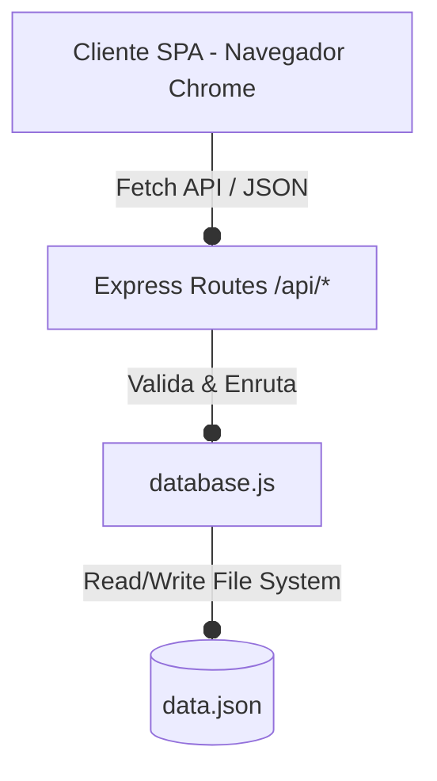

# Arquitectura General

## 1. Vista general
La plataforma **RMB Soluciones** está diseñada bajo un modelo desacoplado de dos capas:
1. **Frontend (Capa de Presentación)**: Una aplicación de página única (SPA) responsiva que interactúa con el backend consumiendo una API REST a través de llamadas HTTP asíncronas (`fetch`).
2. **Backend (Capa de Servicios y Negocio)**: Un servidor RESTful basado en Node.js y Express encargado de procesar solicitudes, validar reglas de negocio, y persistir los datos localmente.

## 2. Estilo arquitectónico
* **API REST + SPA**: La SPA no recarga la página; gestiona las vistas de forma dinámica mediante JavaScript nativo. El backend expone endpoints de tipo REST que envían y reciben datos estrictamente en formato JSON.
* **Persistencia Relacional Local**: Los datos se almacenan en un archivo JSON plano, estructurado lógicamente como una base de datos relacional con colecciones cruzadas mediante referencias (PK y FK).

## 3. Componentes principales
* **Frontend**:
  * `index.html`: Estructura base de la SPA, menús responsivos de Bootstrap 5, sidebar de navegación y secciones.
  * `css/styles.css`: Estilos personalizados de la paleta Gris y Azul Claro con efectos dinámicos.
  * `js/app.js`: Enrutador de la SPA, controladores de red Fetch, autorelleno de clientes y renderizadores de UI.
* **Backend**:
  * `server.js`: Punto de entrada de la aplicación, configuración de Express, middlewares CORS/JSON y hosting de archivos estáticos.
  * `routes/clients.js`: Enpoints REST para la gestión de clientes.
  * `routes/services.js`: Endpoints REST para la creación y transición de estado de órdenes de servicio.
  * `database.js`: Capa de abstracción de datos para el acceso seguro a `data.json`.

## 4. Flujo general de datos
1. El usuario interactúa con la SPA (por ejemplo, ingresa una Cédula).
2. `app.js` captura el evento, realiza una petición asíncrona a `/api/clients/:cedula`.
3. El router de Express recibe la petición y llama a la función en `database.js`.
4. `database.js` lee sincrónicamente `data.json`, localiza el cliente y calcula la cantidad de órdenes históricas mediante un conteo cruzado.
5. El backend responde con un JSON estructurado `{ success: true, data: { ... } }`.
6. El frontend procesa la respuesta y actualiza la vista (autorellena nombre, teléfono e historial).

## 5. Decisiones técnicas relevantes
* **Node.js + Express**: Proporciona un entorno rápido y modular idóneo para APIs REST livianas.
* **Persistencia JSON local**: Resuelve los requerimientos de la asignatura sin incurrir en la sobrecarga de instalar o configurar motores de bases de datos de red, simplificando la entrega académica del repositorio.
* **SPA JavaScript Vanilla**: Se optó por JavaScript puro para evitar dependencias complejas de empaquetado (como Webpack o Vite) y mantener el proyecto sumamente portable y fácil de auditar por el docente.
