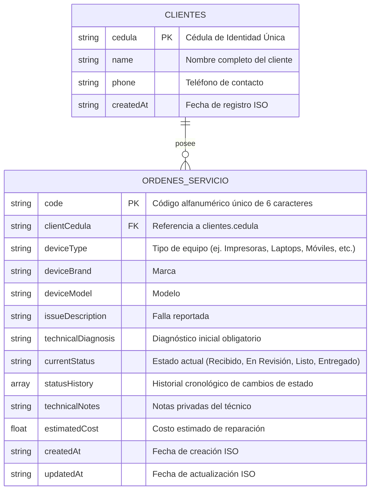

# Modelo de Datos

## 1. Descripción general
Para cumplir con las buenas prácticas de diseño de software y optimización, la base de datos local en `data.json` se organiza mediante un esquema relacional lógico compuesto por dos colecciones principales: `clientes` y `ordenes_servicio`. La relación se establece a través de la Cédula de Identidad del cliente.

## 2. Diagrama Entidad-Relación (ER)
El modelo de datos sigue una relación de uno a muchos (un cliente puede poseer múltiples órdenes de servicio a lo largo de su historial en el taller):

## 3. Diccionario de Datos

### Colección: `clientes`
Representa el padrón permanente de usuarios del servicio técnico.

| Campo | Tipo | Restricción | Descripción |
| :--- | :--- | :--- | :--- |
| `cedula` | `String` | **PK**, Unique, Not Null | Cédula de Identidad (ID nacional), mínimo 6 caracteres. |
| `name` | `String` | Not Null | Nombre completo del cliente. |
| `phone` | `String` | Not Null | Número de teléfono de contacto. |
| `createdAt` | `String` (ISO Date) | Not Null | Fecha y hora en que se registró el cliente. |

### Colección: `ordenes_servicio`
Representa los registros de mantenimiento e ingresos de dispositivos al taller.

| Campo | Tipo | Restricción | Descripción |
| :--- | :--- | :--- | :--- |
| `code` | `String` (6 chars) | **PK**, Unique, Not Null | Código de 6 caracteres alfanumérico generado en mayúsculas. |
| `clientCedula` | `String` | **FK** (`clientes.cedula`), Not Null | Cédula del cliente propietario del dispositivo. |
| `deviceType` | `String` | Not Null | Tipo de dispositivo (ej. `Impresoras`, `Laptops`, `Móviles`, `Otros`). |
| `deviceBrand` | `String` | Not Null | Marca del equipo. |
| `deviceModel` | `String` | Not Null | Modelo del equipo. |
| `issueDescription` | `String` | Not Null | Falla descrita por el cliente. |
| `technicalDiagnosis` | `String` | Not Null | Diagnóstico inicial obligatorio cargado por el técnico. |
| `currentStatus` | `String` | Not Null | Estado de la orden. Valores: `Recibido`, `En Revisión`, `Listo`, `Entregado`. |
| `statusHistory` | `Array` | Not Null | Arreglo de objetos `{ status, timestamp, note }` de auditoría. |
| `technicalNotes` | `String` | Nullable | Anotaciones privadas adicionales del técnico. |
| `estimatedCost` | `Number` | Default: `0` | Costo estimado de la reparación. |
| `createdAt` | `String` (ISO Date) | Not Null | Fecha y hora de creación. |
| `updatedAt` | `String` (ISO Date) | Not Null | Fecha y hora de última modificación. |

## 4. Reglas de integridad
* **Integridad Primaria**: No se permiten dos clientes con la misma `cedula` ni dos órdenes de servicio con el mismo `code`.
* **Integridad Referencial**: No se puede registrar una orden en `ordenes_servicio` si la `clientCedula` no existe previamente en `clientes`.
* **Inmutabilidad del Historial**: Las entradas añadidas a `statusHistory` son históricas, acumulan marcas de tiempo reales generadas por el backend y no pueden ser editadas ni reordenadas por la API.
